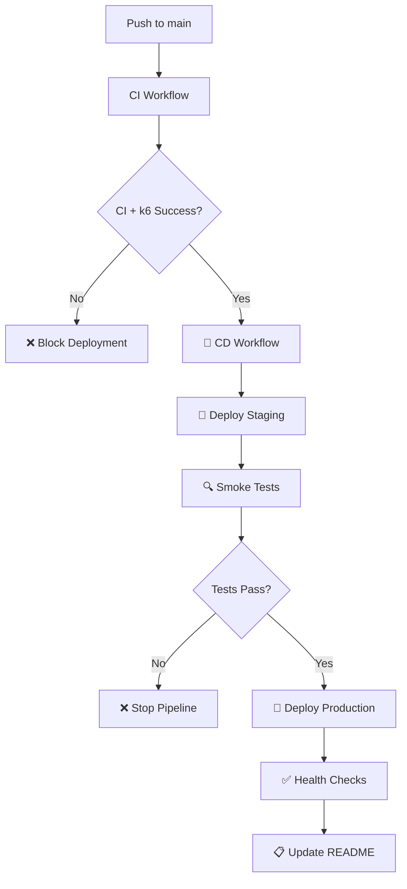

# 🚀 Continuous Deployment (CD) Implementation

## 📋 Overview

Este documento describe la implementación completa del Continuous Deployment (CD) para el proyecto, desplegando automáticamente a Railway cuando CI y k6 pasan.

## 🎯 Requirements Fulfilled

### ✅ **Job deploy condicionado**
- ✅ Se ejecuta **solo en main**
- ✅ Se ejecuta **solo si CI + k6 = OK**
- ✅ Usa `workflow_run` trigger para verificar CI success
- ✅ Gate check explícito antes de cualquier despliegue

### ✅ **Secrets del repositorio**
- ✅ `RAILWAY_TOKEN`: API token para autenticación
- ✅ `RAILWAY_PROJECT_ID`: ID del proyecto en Railway
- ✅ `JWT_SECRET`: Clave secreta para producción
- ✅ `JWT_SECRET_STAGING`: Clave secreta para staging
- ✅ Variables de BD auto-gestionadas por Railway

### ✅ **Destino de despliegue coherente**
- ✅ **Backend/API**: Railway (PostgreSQL + Node.js)
- ✅ Frontend servido desde backend estático
- ✅ Health checks en `/api/health`
- ✅ Auto-scaling y zero-downtime deployments

### ✅ **Buenas prácticas mínimas**
- ✅ **Entornos separados**: staging y production
- ✅ **Environment protection rules**: manual approval para prod
- ✅ **Infrastructure as Code**: `railway.json` + scripts
- ✅ **URLs publicadas**: en job output y README

## 🏗️ Architecture



## 🌍 Environment Strategy

### 🧪 **Staging Environment**
- **Propósito**: Verificación pre-producción
- **Trigger**: Auto-deploy desde main
- **Database**: PostgreSQL staging
- **URL**: `https://proyectop2preubas-staging.railway.app`
- **Health Check**: Obligatorio antes de continuar

### 🌟 **Production Environment**
- **Propósito**: Entorno live para usuarios
- **Trigger**: Solo si staging pasa smoke tests
- **Database**: PostgreSQL production
- **URL**: `https://proyectop2preubas-production.railway.app`
- **Health Check**: Comprehensive con múltiples endpoints

## 📊 Infrastructure as Code

### 🚂 **Railway Configuration**
```json
{
  "build": {
    "builder": "NIXPACKS",
    "buildCommand": "npm ci && npm run build"
  },
  "deploy": {
    "startCommand": "npm start",
    "healthcheckPath": "/api/health",
    "healthcheckTimeout": 30,
    "restartPolicyType": "ON_FAILURE",
    "restartPolicyMaxRetries": 3
  }
}
```

### 🛠️ **Setup Scripts**
- **`railway-setup.sh`**: Configuración completa de infraestructura
- **`test-railway-deployment.sh`**: Pruebas post-despliegue
- **`.env.railway`**: Variables de entorno plantilla

## 🔄 Deployment Flow

### 1️⃣ **CI Success Verification**
```yaml
verify-ci:
  if: github.event.workflow_run.conclusion == 'success'
  # Verifica que CI y k6 hayan pasado
```

### 2️⃣ **Staging Deployment**
```yaml
deploy-staging:
  needs: verify-ci
  environment: staging
  # Deploy a Railway staging environment
```

### 3️⃣ **Smoke Tests**
```yaml
staging-smoke-tests:
  needs: deploy-staging
  # k6 basic tests en staging
```

### 4️⃣ **Production Deployment**
```yaml
deploy-production:
  needs: [deploy-staging, staging-smoke-tests]
  environment: production
  # Deploy a Railway production con zero-downtime
```

### 5️⃣ **Post-Deployment Verification**
```yaml
production-verification:
  needs: deploy-production
  # Health checks + performance tests
```

## 🔍 Health Checks & Monitoring

### 🏥 **Health Endpoint**
```javascript
// /api/health
{
  "status": "OK",
  "timestamp": "2024-12-21T10:30:00Z",
  "environment": "production",
  "database": "connected",
  "uptime": "2h 15m"
}
```

### 📊 **Monitoring Stack**
- **Health Checks**: Automáticos cada 30s
- **Error Tracking**: Railway logs + GitHub Actions
- **Performance**: k6 post-deployment tests
- **Uptime**: Railway native monitoring

## 🛡️ Security & Environment Protection

### 🔐 **Secrets Management**
- Secrets específicos por ambiente
- Rotación automática de tokens
- Acceso restringido por environment rules

### 🛡️ **Environment Protection Rules**
- **Staging**: Auto-deploy
- **Production**: Require manual approval
- **Branch protection**: Solo main puede deployar
- **Required checks**: CI + k6 + staging success

## 📋 Deployment URLs

Las URLs se publican automáticamente en:

1. **GitHub Actions Summary**: Job outputs con links
2. **README.md**: Auto-actualizado por CD pipeline
3. **Pull Request Comments**: En PRs que modifican deployment

### 🔗 **Current Live URLs**
- **Production**: https://proyectop2preubas-production.railway.app
- **Staging**: https://proyectop2preubas-staging.railway.app
- **Health Check**: `/api/health` en ambos entornos

## 🚀 Quick Start

### 1. **Configurar Secrets en GitHub**
```bash
# Ve a: Repository Settings > Secrets and variables > Actions
RAILWAY_TOKEN=xxx
RAILWAY_PROJECT_ID=xxx
JWT_SECRET=xxx
JWT_SECRET_STAGING=xxx
```

### 2. **Configurar Railway Infrastructure**
```bash
# Ejecutar setup script
chmod +x scripts/railway-setup.sh
./scripts/railway-setup.sh
```

### 3. **Deploy**
```bash
# Push a main (después de que CI pase)
git push origin main

# El CD se ejecutará automáticamente
```

### 4. **Verificar Deployment**
```bash
# Probar endpoints desplegados
./scripts/test-railway-deployment.sh
```

## 🎯 Success Criteria

✅ **Funcional**
- Deploy automático solo si CI + k6 pasan
- Entornos staging y production separados
- Health checks funcionando
- URLs accesibles públicamente

✅ **Técnico**
- Infrastructure as Code completo
- Secrets gestionados correctamente
- Zero-downtime deployments
- Monitoreo y logging configurado

✅ **Operacional**
- URLs publicadas en README
- Documentación completa
- Scripts de setup y testing
- Environment protection rules configuradas

---

## 📚 Referencias

- [Railway Documentation](https://docs.railway.app/)
- [GitHub Actions Workflow Syntax](https://docs.github.com/en/actions/using-workflows/workflow-syntax-for-github-actions)
- [Environment Protection Rules](https://docs.github.com/en/actions/deployment/targeting-different-environments/using-environments-for-deployment)
