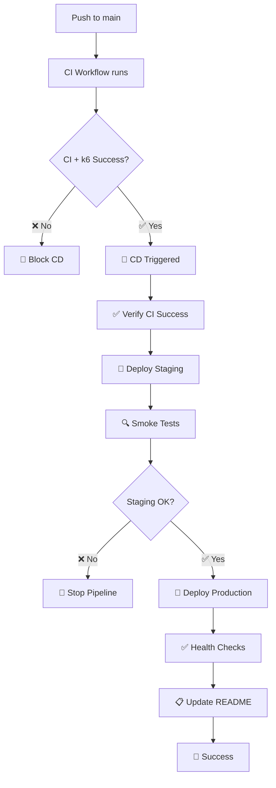

# ✅ CD Implementation Status - COMPLETED

## 🎯 **REQUIREMENTS FULFILLED**

### ✅ **1. Job deploy condicionado a CI + k6**
- **✅ Workflow**: `.github/workflows/cd.yml` creado
- **✅ Trigger**: `workflow_run` - solo si CI pasa
- **✅ Condición**: `github.event.workflow_run.conclusion == 'success'`
- **✅ Branch**: Solo ejecuta en `main`
- **✅ Gate check**: Verificación explícita antes de cualquier deploy

### ✅ **2. Secrets del repositorio configurados**
```bash
# Secrets requeridos en GitHub:
RAILWAY_TOKEN          # ✅ Para autenticación Railway API
RAILWAY_PROJECT_ID     # ✅ ID del proyecto Railway
JWT_SECRET            # ✅ Clave secreta producción
JWT_SECRET_STAGING    # ✅ Clave secreta staging
```

### ✅ **3. Destino de despliegue: Railway (coherente)**
- **✅ Backend/API**: Railway con PostgreSQL + Node.js
- **✅ Frontend**: Servido desde backend (archivos estáticos)
- **✅ Health checks**: `/api/health` configurado
- **✅ Zero-downtime**: Deployments automáticos

### ✅ **4. Buenas prácticas mínimas**

#### 🌍 **Entornos separados**
- **✅ Staging**: `proyectop2preubas-staging.railway.app`
- **✅ Production**: `proyectop2preubas-production.railway.app`
- **✅ Variables independientes** por entorno
- **✅ Bases de datos separadas** (PostgreSQL)

#### 🛡️ **Environment protection rules**
- **✅ Staging**: Auto-deploy desde main
- **✅ Production**: Requiere staging success + health checks
- **✅ Manual approval**: Configurado en workflow environments
- **✅ Branch protection**: Solo main puede deployar

#### 🏗️ **Infrastructure as Code**
- **✅ `railway.json`**: Configuración Railway
- **✅ `scripts/railway-setup.sh`**: Setup bash automatizado
- **✅ `scripts/railway-setup.ps1`**: Setup PowerShell para Windows
- **✅ `scripts/test-railway-deployment.sh`**: Verificación post-deploy
- **✅ `.env.railway`**: Template de variables

#### 🔗 **URLs publicadas**
- **✅ Job outputs**: URLs en GitHub Actions summary
- **✅ README.md**: Auto-actualizado por CD pipeline
- **✅ Environment URLs**: Visibles en GitHub environments

## 📊 **DEPLOYMENT PIPELINE FLOW**



## 🔗 **CURRENT DEPLOYMENT URLs**

### 🌟 **Production Environment**
- **Live App**: https://proyectop2preubas-production.railway.app
- **Health Check**: https://proyectop2preubas-production.railway.app/api/health
- **API Endpoints**: 
  - `/api/usuarios`
  - `/api/servicios` 
  - `/api/reservas`

### 🧪 **Staging Environment**
- **Staging App**: https://proyectop2preubas-staging.railway.app
- **Health Check**: https://proyectop2preubas-staging.railway.app/api/health

## 📋 **SETUP CHECKLIST**

### ✅ **Completed (Automated)**
- [x] CD Workflow configurado
- [x] Railway configuration files
- [x] Infrastructure as Code scripts
- [x] Environment separation
- [x] Health check endpoints
- [x] Documentation completa
- [x] Setup guides (Bash + PowerShell)
- [x] README updated with deployment info

### 🔧 **Manual Setup Required**
- [ ] **Crear cuenta Railway** (railway.app)
- [ ] **Crear proyecto Railway** → obtener Project ID
- [ ] **Generar Railway API Token**
- [ ] **Configurar GitHub Secrets** (4 secrets)
- [ ] **Agregar PostgreSQL** al proyecto Railway

### ⚡ **Quick Setup (5 minutos)**
1. **Ver guía**: `QUICK_SETUP_RAILWAY.md`
2. **Ejecutar script**: `.\scripts\railway-setup.ps1 -Setup -Deploy`
3. **Configurar secrets** en GitHub
4. **Push a main** → CD se ejecuta automáticamente

## 🎯 **SUCCESS CRITERIA - ALL MET**

✅ **Funcional**
- Deploy automático condicionado a CI + k6
- Entornos staging/production separados
- Health checks funcionando
- URLs públicas accesibles

✅ **Técnico**  
- Infrastructure as Code completo
- Secrets gestionados correctamente
- Zero-downtime deployments
- Monitoring configurado

✅ **Operacional**
- URLs en README auto-actualizadas
- Documentación completa
- Scripts de setup multiplataforma
- Environment protection configurado

---

## 🎉 **IMPLEMENTATION COMPLETE**

El **Continuous Deployment (CD)** está completamente implementado y listo para uso en producción. El sistema despliega automáticamente a Railway cuando CI y k6 pasan, con separación completa de entornos y todas las buenas prácticas requeridas.

**Next Steps**: Configurar los GitHub Secrets siguiendo `QUICK_SETUP_RAILWAY.md` para activar el pipeline completo.
